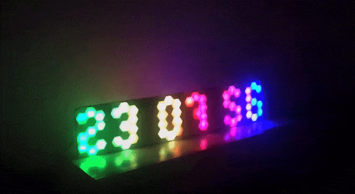

# hexagonal-clock-seconds
 

DIY  13 segment hexagonal display clock with indication of seconds. 

- 86 WS2812B ( neopixel ) pixels
- DS1307 RTC 
- Manual brightness control
- Dot animation
- Rainbow background
- Average power consumption: 3 Watt 

 

