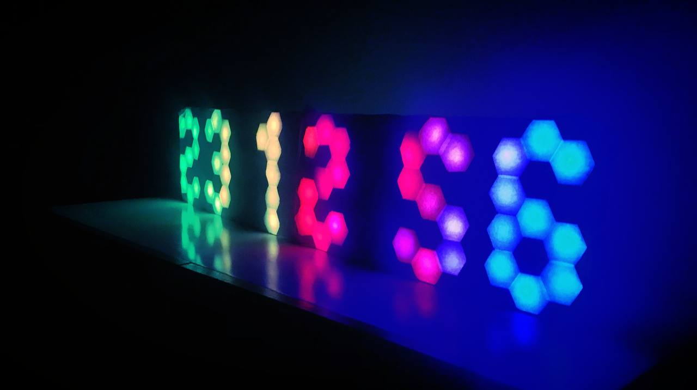

# hexagonal-clock-seconds
Diy neopixel clock with indication of seconds. Based on 13 segment hexagonal display modules

 

DIY  13 segment hexagonal display clock 
- 86 WS2812B pixels
- DS1307 RTC 
- Manual brightness control
- Dot animation
- Rainbow background
- Average power consumption: 3 Watt 

 

